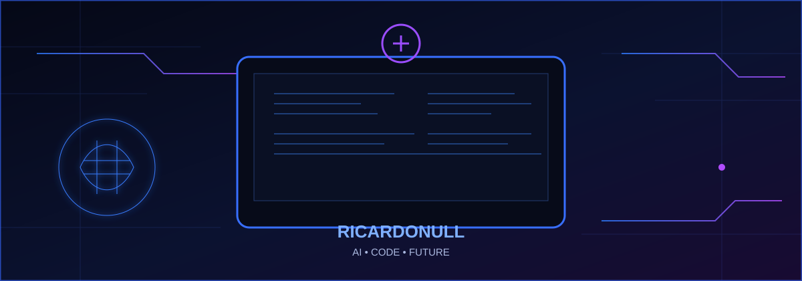

<div align="center">
  
</div>

<div align="center">
  
</div>

<p align="center">
  
</p>

<h1 align="center">👋 RICARDONULL</h1>
<p align="center"><strong>🤖 Estudante de Inteligência Artificial no PIT • Desenvolvedor em formação</strong></p>

<p align="center">
  
  
</p>

---

<table width="100%">
<tr>
<td width="52%" valign="top">

## 🧠 SOBRE MIM

🎓 Faço faculdade de **Inteligência Artificial no PIT (Piauí Instituto de Tecnologia)**.

💻 Estou construindo minha trajetória na tecnologia através dos estudos, da programação e da prática.

🤖 Tenho interesse em **Inteligência Artificial, desenvolvimento de software e novas tecnologias**.

🚀 Meu objetivo é aprender, criar projetos e evoluir constantemente como desenvolvedor.

</td>
<td width="48%" valign="top">

## ⚙️ TECNOLOGIAS

<p align="center"></p>

<p align="center">


</p>

</td>
</tr>
</table>

---

## 📊 GITHUB DASHBOARD

<table width="100%">
<tr>
<td width="50%" align="center"></td>
<td width="50%" align="center"></td>
</tr>
</table>

<p align="center"></p>

---

## 🏆 TROFÉUS

<p align="center"></p>

---

## 🚧 PROJETOS EM DESTAQUE

<table width="100%">
<tr>
<td width="33%" align="center">

### 🤖 IA LAB

`EM CONSTRUÇÃO`

</td>
<td width="33%" align="center">

### 💻 CODE LAB

`EM CONSTRUÇÃO`

</td>
<td width="33%" align="center">

### 🚀 FUTURO

`EM CONSTRUÇÃO`

</td>
</tr>
</table>

> Novos projetos aparecerão aqui conforme forem desenvolvidos. 👨‍💻

---

## 🟢 SYSTEM STATUS

```text
╔══════════════════════════════════════════════╗
║              RICARDONULL // AI               ║
╠══════════════════════════════════════════════╣
║  STATUS        : ONLINE                      ║
║  FOCUS         : ARTIFICIAL INTELLIGENCE     ║
║  LEARNING      : JAVASCRIPT • WEB • GIT      ║
║  ENVIRONMENT   : CODE + AI                   ║
║  MISSION       : LEARN • BUILD • EVOLVE      ║
╚══════════════════════════════════════════════╝
```

<div align="center">
  
</div>

---

<p align="center">
  
</p>

<p align="center"><b>🤖 Aprendendo Inteligência Artificial • Construindo meu futuro na tecnologia 🚀</b></p>
